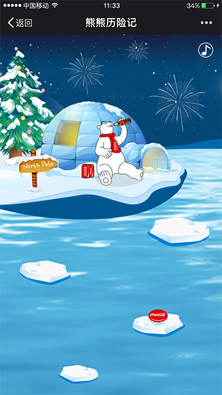

# 使用layabox开发的H5游戏

---

 北极熊跳跃冰块回家
 
---

##### 环境

所需组件：

 1. LayaAir IDE 1.7.12

##### 技术栈

> [Layabox](https://www.layabox.com/)

---
### 截图

---

---

### 测试及发布

使用LayaAir IDE测试环境及发布

### 目录结构
<pre>
.
├── README.md           
├── release                  // 项目发布目录
├── print                    // 项目截图目录
├── bin                      // 静态资源目录
├── laya                     // 图集及UI目录
├── src                      // 生产目录
.
</pre>
